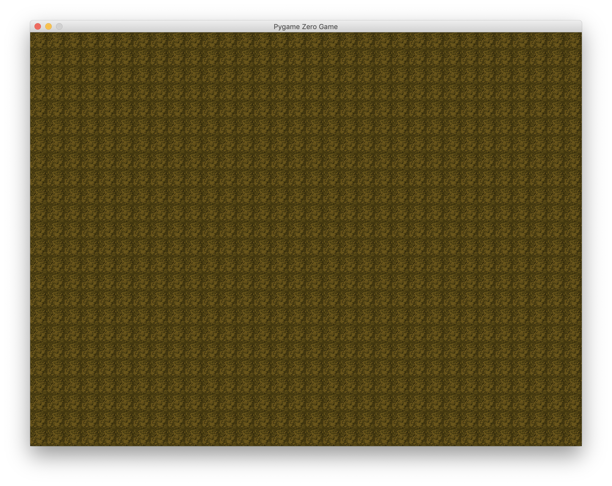
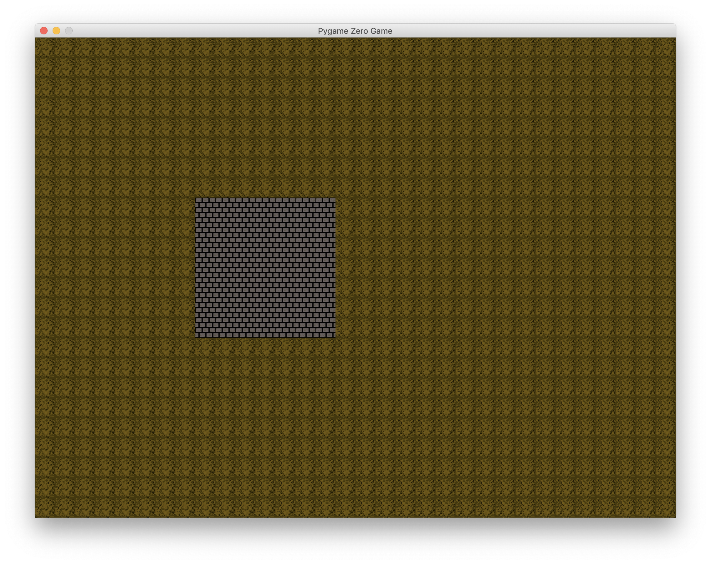
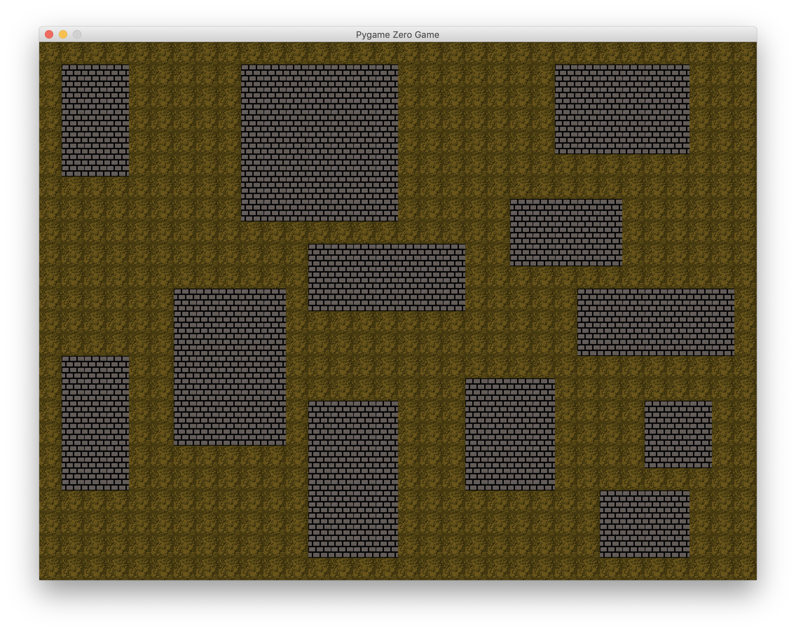
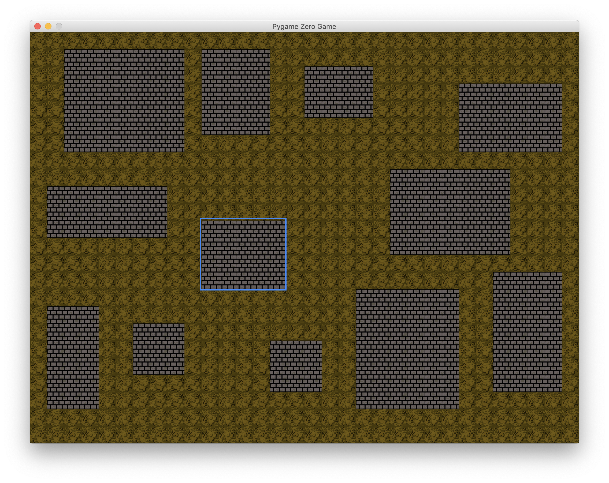
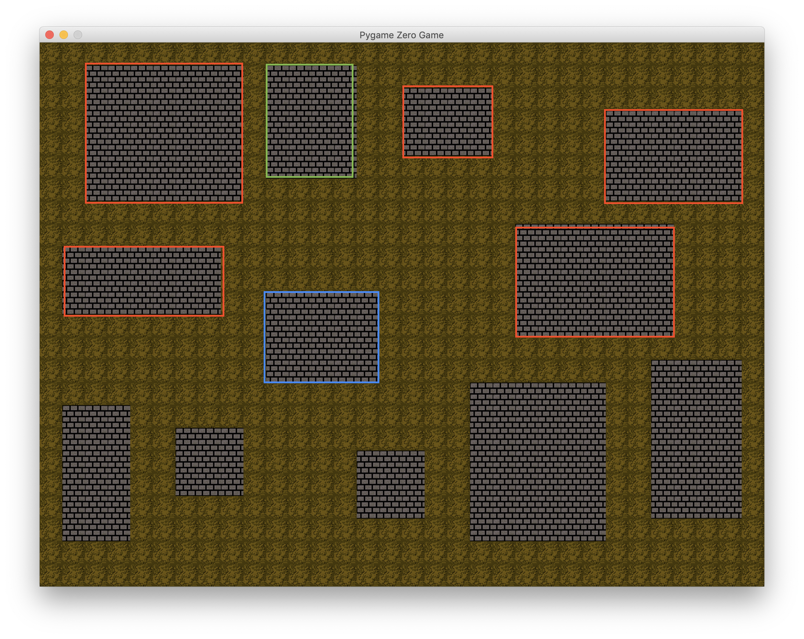

# What is procedural generation?

Games are works of art, and often require hours of delicate and purposeful designing to craft their unique experiences. If you want to create expansive games, with many worlds and challenges for your players to attempt to overcome; this can require take 100s of hours of design alone. Sometimes the game you are creating can benefit from some random elements, in levels particularly. 

If your game relies on large amounts of loot and hordes of enemies, then some randomness in the level design can keep your game feeling fresh and keep players on their toes. Games like Diablo, thrive off of their variety of environments and dungeons for players to explore in the search of better loot. Diablo makes great use of procedural generation to create their dungeons, they are not pre-designed level layouts but instead are created each time the player reaches a new location. 

In this guide, I am going to walk you through the creation of a procedural generation system using Python and Pygame. I want to show you that it is not a lack of designing at all but instead you have to change what you are designing. The focus of this article will be the rules I am implementing to create my system. This is not a one technique field, and there are hundreds of variations on the ways procedural generation is implemented, I will do my best to signpost these as we go through. 

# Setup

I am using Pygame and Python to create this system, but I am going to keep the explanations as general as possible so that you can apply these principles to whichever development environments you enjoy working in. The point of this guide is to show you how you can implement procedural generation and some of the techniques and tactics involved. 

I am going to use procedural generation to create a tiled level, stored in arrays that can be drawn by any script. I have made this choice because it allows me to use my procedural generation in whatever script I am running, so I can keep it seperate from any game code I am writing and just use it to populate a Map array that my game uses. 

~~~python
# Importing modules
import secrets # Secrets is a crypto grade randomness library - in my opinion better than random for this.
import math # For the math
from collections import namedtuple # Named tuples will be used to store information about the rooms
from pygame import Rect # This will be used to check for collisions.

# Map variables
TILE_SIZE = 32 # Dimensions of the tiles - change if neccessary
TILE_ACROSS = 32 # Use the previous variables to set a tile width
TILE_DOWN = 24 # and tile height

# Pygame variables
# Setting the width and height of the pygame window
WIDTH = TILE_SIZE * TILE_ACROSS
HEIGHT = TILE_SIZE * TILE_DOWN

def create_map():
    Map = []
    for y in range(TILE_DOWN):
        row = []
        for x in range(TILE_ACROSS):
            row.append(0)
        Map.append(row)
    return Map
~~~ 

This is the start of my project, and it establishes our first set of rules. Using variables as much as possible to control the constants in our system makes it easy to change them later. The tiles I will be working with are 32x32 pixels, but if I change them and want 64x64 tiles I only need to change 1 variable and my whole map will adjust. The other variables, are dependent on the tile size, but the WIDTH and HEIGHT variables will dictate how big the map is in pixels. 

The map is a 2 dimensional array, which matches the TILE_ACROSS and TILE_DOWN dimensions. To start off with it will be populated with entirely 0s. When I draw my map, 0 will identify a dirt tile, which means my map currently looks like this...

This is pretty boring, so lets create some rooms to populate them. 

## Create a room 

To create rooms through code, we first need to designate some rules for rooms in my map. 

When you are creating things through procedural generation, you still need to design but you design sets of rules rather than the nitty gritty of the levels design. The idea is that your rules, if they are followed, should guide the randomness in a way that means the levels have the feel and look you are after. 

The initial rules for my rooms are: 
1. Choose a random width and height
3. Choose a random position

These are my starters, but they are not finished yet and there are some flaws that need to be addressed. 

You won't want a room to have a width or height of 0, or even 1 for that matter. A room 1 tile high or wide would be more of a corridor. I also don't want a room that is the same size as my world, or even half of it. This means I need to set maximum and minimum room sizes, which I can accomplish through variables and an equation for randomising the width and height. 

I should also put some restrictions on the positions my rooms can appear in. I want there to be a border of at least a tile around the edge of my map. 

The final rules for the creation of my rooms are. 
1. Choose a random width and height but..
    + it should not be larger than 7 
    + nor less than 2.
2. Choose a random position on the map
3. The rooms details should be stored so they can be used later on 

~~~python
MAX_ROOM_SIZE = 7
MIN_ROOM_SIZE = 3
ROOM_PADDING = 2

MAP_BORDER = 1

NUMBER_OF_ROOMS = 12

Room = namedtuple('Room', ['width', 'height', 'pos_x', 'pos_y'])

def generate_room():
    rm_width = MIN_ROOM_SIZE + secrets.randbelow(MAX_ROOM_SIZE - MIN_ROOM_SIZE + 1)
    rm_height = MIN_ROOM_SIZE + secrets.randbelow(MAX_ROOM_SIZE - MIN_ROOM_SIZE + 1)

    rm_pos_x = secrets.randbelow(TILE_ACROSS - rm_width)
    if rm_pos_x < MAP_BORDER:
        rm_pos_x = MAP_BORDER
    rm_pos_y = secrets.randbelow(TILE_DOWN - rm_height)
    if rm_pos_y < MAP_BORDER:
        rm_pos_y = MAP_BORDER

    return Room(rm_width, rm_height, rm_pos_x, rm_pos_y)
~~~

## Generate multiple rooms

To fully populate the rooms in my map, I will use another variable to decide how many there will be. I have been working with 10 or so rooms, but feel free to mess with these variables to suit your needs. The main challenge with this stage is making sure the rooms don't overlap!

**Stopping overlaps** 

Using a named tuple to store the information about the rooms I am generating will be essential for the work I will do later, but it is also useful to make sure the rooms don't overlap. 

To do this, I have created another function called `create_rooms()`. This function will run a loop and generate an array of rooms. It calls the generate_rooms function to create rooms and then check whether they overlap with other rooms already generated. If the room does overlap, it is rejected and a new one is created. 

~~~python
ROOM_PADDING = 2

NUMBER_OF_ROOMS = 12

def create_rooms():
    Rooms = []
    for i in range(NUMBER_OF_ROOMS):
        intersect = True
        while intersect: 
            intersect = False
            rm = generate_room()
            for other in Rooms:
                room = other[0]
                padded_pos_x = rm.pos_x - 1
                padded_pos_y = rm.pos_y - 1
                padded_width = rm.width + 3
                padded_height = rm.height + 3
                rm_1 = Rect((room.pos_x*32, room.pos_y*32),
                                 (room.width*32, room.height*32))
                rm_2 = Rect((padded_pos_x*32, padded_pos_y*32),
                                 (padded_width*32, padded_height*32))
                if rm_1.colliderect(rm_2):
                    intersect = True
        Rooms.append([rm, {"NORTH": None, "SOUTH": None, "EAST": None, "WEST": None}])
    return Rooms
~~~

I am using the Rect objects in pygame to test for collisions between rooms. I have set a ROOM_PADDING variable which makes sure there is at least 1 square either side of my rooms. I create 2 rectangles that represent the rooms and ask pygame to check if they collide. This is done recursively, checking all the rooms that have already been created. 

I have also updated the `create_map()` function to draw the rooms into the Map array when they have been generated and tested. 

~~~python
def create_map():
    Map = []
    for y in range(TILE_DOWN):
        row = []
        for x in range(TILE_ACROSS):
            row.append(0)
        Map.append(row)
    Rooms = create_rooms()
    for rm in Rooms:
        for y in range(rm[0].height):
            for x in range(rm[0].width):
                Map[rm[0].pos_y+y][rm[0].pos_x+x] = 1
    return Map
~~~

With that, my map has been populated with rooms. 

### Creating Corridors

Now that I have rooms in my level, it would be good to get them connected together right? To do that, I first have to think about some rules for my corridors. 

A small caveat before the next part, there are so so many ways to do procedural generation and particularly there are lots of ways of connecting your dungeon together. As I go through the next bit I will try and point out to you where I could have used another method to connect the rooms and hopefully shed some light as to why I chose to do it the way I have. 

I am creating a tile based game, and so my options for corridors are already limited. I can't have curved corridors (thank goodness, curve maths is tough), and to be honest diagonal corridors don't tend to look that good. If I had smaller tiles and therefore more, I could do diagonals but with my current layout they just end up looking like stairs. 

This means my corridors will be straight, which ties in well with my current map style. Next I had to decide how I wanted the rooms to connect. 

Each room in my map could be connected to each of the others, but I suspect this would be messy and would leave my map feeling cluttered. To combat this I can limit the connections my rooms can have, but how many? To keep it simple, I am going to limit it to 4 possible connections: North, East, South and West. These are potential connections not a guarantee, I would like some degree of randomness in my connections. 

The rules for my corridors will be...
1. Each room can have a maximum of 4 connections
2. They can go in one of these 4 directions:
    + North
    + East
    + South
    + West
3. Before building the connection there will be a chance to skip it

**Choosing the connections** 

This brings me to the algorithmic section of this task, how to choose which rooms to connect to. Saving the information about each room will help me here. 

Let's take a look at the following room and see how we can find connections for it. 

With as many rooms as I have, there is never going to be a need for corners in the corridors. I should be able to find a connection in any of the directions using only a straight line. 

The best way to do this is to test the other rooms to see if they meet 2 criteria. 
1. It is in the given direction in relation to the current room
    + i.e they have a lower y if it is a Northern connection
2. It overlaps with the current room on either the x or y axis 
    + i.e for a North connection they should overlap in the x axis. 

Looking back at the map I showed you earlier... 

The rooms highlighted in orange all meet the first criteria for a North connection, but not the second. The range of x co-ordinates covered by the rooms does not overlap with the range of the room we want to add a connection to. The room highlighted green however, does meet both criteria. I can test each room's x range for both north and south, but for east and west the overlap will be in the y range covered by the room. 

Here is the code to choose the corridors; 

~~~python 
def create_corridors(rm, Rooms):
    candidates = {"NORTH": None, "SOUTH": None, "EAST": None, "WEST": None}
    for other in Rooms:
        if other[0] != rm[0]:
            current_room = rm[0]
            other_room = other[0]
            left_marker = max(current_room.pos_x, other_room.pos_x)
            right_marker = min(current_room.pos_x + current_room.width, other_room.pos_x + other_room.width)
            horizontal_overlap = list(range(left_marker, right_marker))
            if len(horizontal_overlap) > 0:
                vertical_corridors(candidates, other, rm, horizontal_overlap)
            top_marker = max(current_room.pos_y, other_room.pos_y)
            bottom_marker = min(current_room.pos_y + current_room.height, other_room.pos_y + other_room.height)
            vertical_overlap = list(range(top_marker, bottom_marker))
            if len(vertical_overlap) > 0:
                horizontal_corridors(candidates, other, rm, vertical_overlap)
    return candidates
~~~

If there are multiple rooms that overlap and meet the first criteria, then a decision has to be made. There are lots of ways to do this; shortest path, best angle... etc. I am going to go for the shortest path, so if there are 2 options that meet the 2 criteria I will select the one that is the closest in the direction we are currently working on. 

Here are the functions to create horizontal and vertical corridors

~~~python
def vertical_corridors(candidates, other, rm, horizontal_overlap):
    current_room = rm[0]
    current_connections = rm[1]
    other_room = other[0]
    other_connections = other[1]
    if current_room.pos_y > other_room.pos_y and other_connections["SOUTH"] == None and current_connections["NORTH"] != 0:
        connector = candidates["NORTH"]
        if connector == None:
            candidates["NORTH"] = (other, horizontal_overlap)
            other_connections["SOUTH"] = 0
        else:
            if other_room.pos_y + other_room.height > connector[0][0].pos_y + connector[0][0].height:
                connector[0][1]["SOUTH"] = None
                candidates["NORTH"] = (other, horizontal_overlap)
                other_connections["SOUTH"] = 0
    if current_room.pos_y < other_room.pos_y and other_connections["NORTH"] == None and current_connections["SOUTH"] != 0:
        connector = candidates["SOUTH"]
        if connector == None:
            candidates["SOUTH"] = (other, horizontal_overlap)
            other_connections["NORTH"] = 0
        else:
            if other_room.pos_y < connector[0][0].pos_y:
                connector[0][1]["NORTH"] = None
                candidates["SOUTH"] = (other, horizontal_overlap)
                other_connections["NORTH"] = 0

def horizontal_corridors(candidates, other, rm, vertical_overlap):
    current_room = rm[0]
    current_connections = rm[1]
    other_room = other[0]
    other_connections = other[1]
    if current_room.pos_x > other_room.pos_x and other_connections["EAST"] == None and current_connections["WEST"] != 0:
        connector = candidates["WEST"]
        if connector == None:
            candidates["WEST"] = (other, vertical_overlap)
            other_connections["EAST"] = 0
        else:
            if other_room.pos_x < connector[0][0].pos_x:
                connector[0][1]["EAST"] = None
                candidates["WEST"] = (other, vertical_overlap)
                other_connections["EAST"] = 0
    if current_room.pos_x < other_room.pos_x and other_connections["WEST"] == None and current_connections["EAST"] != 0:
        connector = candidates["EAST"]
        if connector == None:
            candidates["EAST"] = (other, vertical_overlap)
            other_connections["WEST"] = 0
        else:
            if other_room.pos_x + other_room.width < connector[0][0].pos_x + connector[0][0].width:
                connector[0][1]["WEST"] = None
                candidates["EAST"] = (other, vertical_overlap)
                other_connections["WEST"] = 0
~~~

The final consideration is where to actually put my corridors to connect the rooms, and I already have the information I need to do this. When comparing the overlaps, I am left with a range of overlapping values. You could randomly choose one of the values, which will correspond to a straight line in the x or y axis that connects both rooms. I decided to grab the middle value of the range and place the corridor there, I like randomness but I found this method looked more dungeon-y to me. This is an important thing to remember about procedural generation, its all subjective and about how you want it to look and feel. 

This will be done in the create map function, and at this point it is just a path drawing algorithm. There is a little fiddling around with directions on drawing and start and end positions for the corridors. 

~~~python
def create_map():
    Map = []
    for y in range(TILE_DOWN):
        row = []
        for x in range(TILE_ACROSS):
            row.append(0)
        Map.append(row)
    Rooms = create_rooms()
    for rm in Rooms:
        for y in range(rm[0].height):
            for x in range(rm[0].width):
                Map[rm[0].pos_y+y][rm[0].pos_x+x] = 1
        corridors = create_corridors(rm, Rooms)
        #Create the corridors on the map array
        for key, value in corridors.items():
            if len(corridors.items()) > 1:
                skip = secrets.randbelow(100) # Chance to skip drawing this corridor
            else: 
                skip = 100
            if value is not None and value is not 0 and skip > 10:
                dir = [0, 0]
                start_pos = [rm[0].pos_x, rm[0].pos_y]
                end_pos = [value[0][0].pos_x, value[0][0].pos_y]
                mid_overlap = value[1][len(value[1])//2]
                if key == "NORTH":
                    dir[1] = -1
                    start_pos[0] = mid_overlap
                    start_pos[1] -= 1
                    end_pos[0] = mid_overlap
                    end_pos[1] += value[0][0].height
                elif key == "SOUTH":
                    dir[1] = 1
                    start_pos[0] = mid_overlap
                    start_pos[1] += rm[0].height
                    end_pos[0] = mid_overlap
                    end_pos[1] -= 1
                elif key == "EAST":
                    dir[0] = 1
                    start_pos[0] += rm[0].width
                    start_pos[1] = mid_overlap
                    end_pos[0] -= 1
                    end_pos[1] = mid_overlap
                elif key == "WEST":
                    dir[0] = -1
                    start_pos[0] -= 1
                    start_pos[1] = mid_overlap
                    end_pos[0] += value[0][0].width
                    end_pos[1] = mid_overlap
                Map[start_pos[1]][start_pos[0]] = 2
                Map[end_pos[1]][end_pos[0]] = 2 
                distance = (start_pos[0] - end_pos[0]) + (start_pos[1] - end_pos[1])
                next_pos = start_pos
                for i in range(abs(distance)):
                    next_pos = [next_pos[0] + dir[0], next_pos[1] + dir[1]]
                    Map[next_pos[1]][next_pos[0]] = 2 

    return Map
~~~